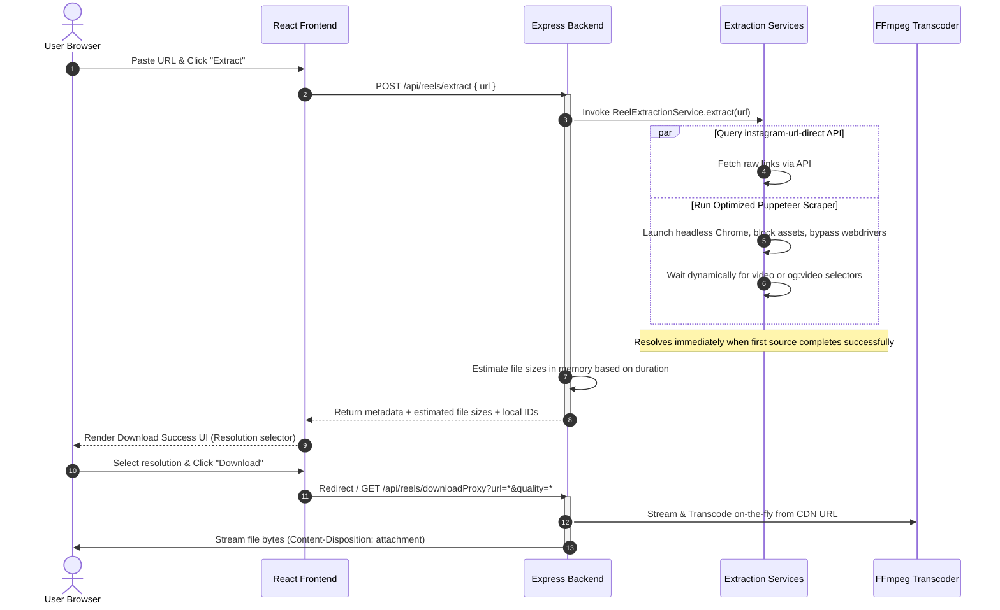

# 🌊 Lumina Reels — System Architecture & Workflow Guide

Lumina Reels (internally referred to as **The Save Tube**) is a premium, high-performance, dark-themed monorepo application designed to download Instagram Reels and Facebook Videos. It leverages a modern frontend interface paired with a robust Node.js/Express backend and background worker automation. The application is designed to be fully stateless, meaning no user information, URL history, or media metadata is saved to any persistent storage or database.

---

## 📁 System Architecture & Directory Tree

The workspace is organized as a monorepo containing distinct `frontend` and `backend` services.

```
reelDownloader/
├── frontend/                     # Client application (Vite + React 19)
│   ├── src/
│   │   ├── platforms/            # Platform-specific downloader containers
│   │   │   ├── instagram/        # Instagram component and service layer
│   │   │   │   ├── InstagramDownloader.jsx
│   │   │   │   └── instagramService.js
│   │   │   └── facebook/         # Facebook component and service layer
│   │   │       ├── FacebookDownloader.jsx
│   │   │       └── facebookService.js
│   │   ├── components/           # Reusable UI & view panels
│   │   │   ├── Dashboard.jsx     # Main landing hub with platform switcher
│   │   │   ├── About.jsx         # Info about the utility
│   │   │   └── Contact.jsx       # Client contact form interface
│   │   ├── services/             # Global service layer (e.g., ad systems)
│   │   ├── App.jsx               # Client shell and state router
│   │   ├── main.jsx              # DOM bootstrapper
│   │   └── *.css                 # Styling system (variables, animations, elements)
│   └── package.json              # Client configurations & dependencies
│
├── backend/                      # REST API Server (Node + Express MVC)
│   ├── src/
│   │   ├── config/               # Infrastructure configs
│   │   │   └── database.js       # MongoDB connection client
│   │   ├── controllers/          # Request handlers and business logic
│   │   │   ├── reelController.js # Reel handling, transcoding & cleanup
│   │   │   └── facebookController.js # Facebook video metadata & streaming proxy
│   │   ├── middleware/           # HTTP pre/post processors (validation, errors)
│   │   ├── models/               # Mongoose DB Schemas
│   │   │   ├── User.js           # Identity record (guest/registered)
│   │   │   ├── Reel.js           # Reel URL caching registry
│   │   │   └── DownloadHistory.js # Analytic log matching User -> Reel
│   │   ├── routes/               # API route maps mapping endpoints to controllers
│   │   ├── services/             # Puppeteer scraper & direct API extraction
│   │   │   ├── extractionService.js # Instagram extraction routines
│   │   │   └── facebookExtractionService.js # Facebook extraction routines
│   │   └── server.js             # Express application entrypoint
│   └── package.json              # Server dependencies
```

---

## 🔄 End-to-End Request & Data Lifecycle

The diagram below illustrates the exact request flow when a user pastes a URL on the client until the browser successfully streams the attachment download:



---

## 🔬 Platform Extraction Pipelines

The application separates Instagram and Facebook extraction logic to accommodate the technical limits of each platform.

### 📸 Instagram Extraction Workflow

1. **URL Normalization**: 
   The incoming URL is stripped of tracking queries (e.g., `?igsh=...`) and normalized to match standard patterns:
   ```regex
   /instagram\.com\/(reel|p|tv)\/[A-Za-z0-9_-]+/i
   ```
2. **First-Pass API Scraper**:
   Attempts fast retrieval using the `instagram-url-direct` library. This is the preferred route due to speed and efficiency.
3. **Headless Browser Fallback**:
   If the direct API fails, the system utilizes a pre-launched singleton headless Chrome instance via `puppeteer` (initialized at server startup to prevent runtime launch overhead).
   - Protects against hangs by enforcing a strict 4-second timeout during browser acquisition.
   - Sets a user agent mimicking desktop Chrome and disables webdriver footprints.
   - Intercepts requests to block high-latency assets (stylesheets, images, fonts, metrics), accelerating load times.
   - Polls for the video tag dynamically and extracts the CDN stream source.
4. **On-the-Fly Transcoding Engine**:
   To provide immediate metadata responses, file sizes are estimated dynamically in memory based on video duration. When the user requests a download:
   - **Low**: Scaled using `-vf scale=-2:'min(480,ih)'` and transcoded on-the-fly with a visual quality factor (`-crf 32`).
   - **Medium**: Scaled using `-vf scale=-2:'min(720,ih)'` and transcoded on-the-fly with a visual quality factor (`-crf 26`).
   - **High**: Streamed directly from the CDN with no transcoding to preserve source fidelity.

### 👥 Facebook Extraction Workflow

To prevent heavy CPU spikes on container environments (like Render), Facebook videos are not transcoded locally.

1. **Extraction**:
   Calls `@renpwn/fb-downloader` to fetch the direct High-Definition (HD) and Standard-Definition (SD) CDN stream links directly.
2. **Virtual File Size Estimations**:
   The service extracts or assigns the video duration and calculates estimated file sizes using the following formulas:
   - **Low (SD)**:
     $$\text{Size}_{\text{low}} = \frac{\text{duration} \times 0.15}{8}\text{ MB}$$
   - **Medium**:
     $$\text{Size}_{\text{medium}} = \frac{\text{duration} \times 0.3}{8}\text{ MB}$$
   - **High (HD)**:
     $$\text{Size}_{\text{high}} = \frac{\text{duration} \times 0.6}{8}\text{ MB}$$
3. **Download Streaming**:
   When the user clicks download, the backend pipes the bytes from the remote Facebook CDN to the client on-the-fly, bypassing browser CORS.

---

## 🛡️ Key Server Utilities

### 🔄 CORS & Referrer Bypass Proxy
Instagram and Facebook CDN links block direct client-side requests using `cross-origin` restrictions. The backend implements two proxy routes:
* **Thumbnail Proxy** (`/api/reels/proxy`): Fetches the image byte array on the backend and streams it back to the client with standard cache headers (`Cache-Control: public, max-age=86400`).
* **Download Proxy** (`/api/reels/downloadProxy`): Streams the target video file by setting the headers below, forcing the client browser to download the file instead of playing it inside the tab:
  ```http
  Content-Disposition: attachment; filename="savetube_reel.mp4"
  Content-Type: video/mp4
  ```

### 🧹 Background Temp-Files Clean Up
To prevent disk space exhaustion from transcoded files:
* **Immediate Cleanup**: Once a proxy download starts, a `setTimeout` triggers a non-blocking `fs.unlink` after **15 seconds** (allowing buffer space for browser download managers).
* **Periodic Cleanup Job**: A persistent cron-like interval runs every **5 minutes** on the server, scanning the `temp` directory and deleting any files with a modification time older than **10 minutes**.

---

## 🛠️ Step-by-Step Developer Guide

### 1. Environment Configurations

Create a `.env` file in both directories using these templates:

#### Backend Config (`backend/.env`)
```env
PORT=5000
MONGODB_URI=your_mongodb_atlas_connection_string
NODE_ENV=development
```
> [!NOTE]
> If `MONGODB_URI` is omitted or connection fails, the server automatically boots into **Demo Mode**, keeping all core downloading capabilities functional.

#### Frontend Config (`frontend/.env`)
```env
VITE_API_URL=http://localhost:5000
```

---

### 2. Local Setup & Execution

Follow these commands to install dependencies and run the project locally.

#### Backend Setup
Open a terminal in the `backend/` folder:
```bash
# Install dependencies
npm install

# Run server in development mode (hot reloading)
npm run dev
```

#### Frontend Setup
Open another terminal in the `frontend/` folder:
```bash
# Install dependencies
npm install

# Run client in development mode
npm run dev
```
Navigate to `http://localhost:5173/` in your browser.

---

### 3. Production Build & Deployment

#### Frontend (Vercel)
The client project is configured to deploy directly to Vercel:
1. Connect your repository to Vercel.
2. Select **Root Directory** as `frontend`.
3. Set the build command to `npm run build` and output directory to `dist`.
4. Add the environment variable `VITE_API_URL` pointing to your production backend URL.

#### Backend (Render)
1. Deploy the `backend` folder as a Web Service.
2. Ensure **Root Directory** is set to `backend`.
3. Set the start command to `npm start`.
4. In settings, verify the platform has `ffmpeg` installed, or use standard buildpacks.
5. Provide your production environmental configurations (`MONGODB_URI`, `PORT`, `NODE_ENV`).

---

### ⚙️ Troubleshooting Guide

> [!WARNING]
> **Puppeteer Sandbox Issues (Linux/Render)**:
> In Linux container hosts, Puppeteer may throw sandbox permission errors. The service handles this by launching with `--no-sandbox` flags. Ensure your production environment has Chrome dependencies installed (e.g., use the Render chrome buildpack or deploy inside a Docker container).

> [!IMPORTANT]
> **FFmpeg Binaries**:
> The backend automatically imports `@ffmpeg-installer/ffmpeg` to resolve the path on the host OS. If you encounter encoding errors, verify the binary has execution permissions in the node modules folder.
